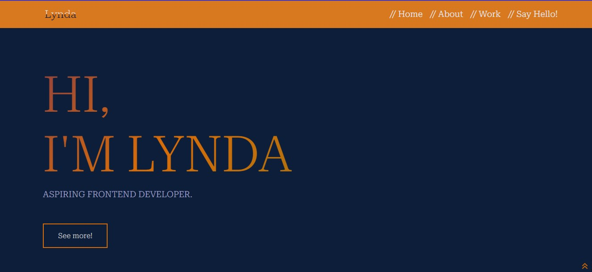

## Table of contents

- [Overview](#overview)
  - [Screenshot](#screenshot)
  - [Links](#links)
- [My process](#my-process)
  - [Built with](#built-with)
  - [What I learned](#what-i-learned)
- [Author](#author)
- [Acknowledgments](#acknowledgments)

## Overview

This is my first Portfolio.

### Screenshot

### Links

- Live Site URL: (https://lynda-obiz.github.io/clipboard-landing-page/)

## My process
My process was hectiic one but i enjoyed every bit of the process in building my portfolio.

### Built with

- Semantic HTML5 markup
- CSS custom properties
- Flexbox
- Grid
- Media Query

### What I learned

Working on this project i learnt using bootstrap and using media query for it to be fully responsive for various devices.

## Author

- Twitter - [LyndaObiz](https://www.twitter.com/LyndaObiz)

## Acknowledgments

Thanks to my tutor  [Adetutu Gbangbola](https://github.com/Adetutu777)  and  [Web3Bridge](https://www.web3bridge.com) community for this opportunity. 